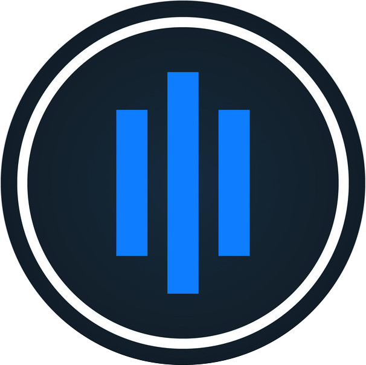

<div align="center">
  
  <h1 align="center">Godax</h1>
  <a href="https://goreportcard.com/report/github.com/bradford-hamilton/godax">
    
  </a>
  <a href="https://godoc.org/github.com/bradford-hamilton/godax">
    
  </a>
  <a href="https://golang.org/dl">
    
  </a>
  <a href="https://codecov.io/gh/bradford-hamilton/godax">
    
  </a>
  <a href="https://github.com/bradford-hamilton/godax/blob/master/LICENSE">
    
  </a>
</div>
<br />
<br />

Coinbase pro client WIP.
___

Docs:
https://docs.pro.coinbase.com

## Features:
- [x] ListAccounts
- [x] GetAccount
- [x] GetAccountHistory
- [x] GetAccountHolds
- [x] PlaceOrder
- [x] CancelOrderByID
- [x] CancelOrderByClientOID
- [x] CancelAllOrders
- [x] ListOrders
- [x] GetOrderByID
- [x] GetOrderByClientOID
- [x] ListFills
- [x] GetCurrentExchangeLimits
- [x] Stablecoin conversions
- [x] Payment methods
- [x] Coinbase accounts
- [x] Fees

## Still needs:
- [ ] Deposits
- [ ] Withdrawals
- [ ] Reports
- [ ] Profiles
- [ ] User account
- [ ] Margin
- [ ] Oracle
- [ ] Market Data: products
- [ ] Market Data: currency
- [ ] Market Data: time
- [ ] WS feed and it's channels

## Testing
```
go test ./...
```
Or with a bit of color
```
make test
```

## Show your support

Give a ⭐ if this project was helpful in any way!