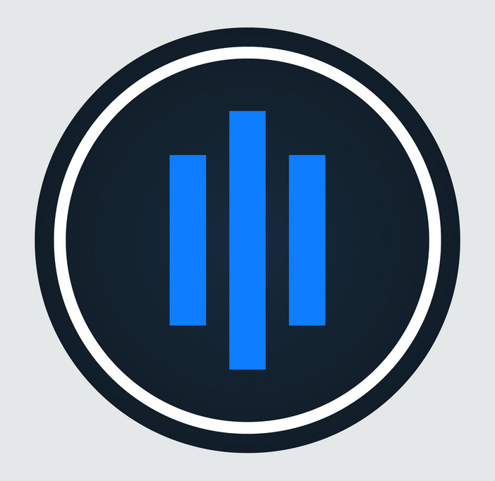

<div align="center">
  
  <h1 align="center">godax</h1>
  <a href="https://goreportcard.com/report/github.com/bradford-hamilton/godax">
    
  </a>
  <a href="https://godoc.org/github.com/bradford-hamilton/godax">
    
  </a>
  <a href="https://golang.org/dl">
    
  </a>
  <a href="https://codecov.io/gh/bradford-hamilton/godax">
    
  </a>
  <a href="https://github.com/bradford-hamilton/godax/blob/master/LICENSE">
    
  </a>
</div>
<br />
<br />

# godax
## coinbase pro client

This is currently a WIP.

## testing
```
make test
```
This runs tests with a little bit of color output.

## Show your support

Give a ⭐ if this project was helpful in any way!